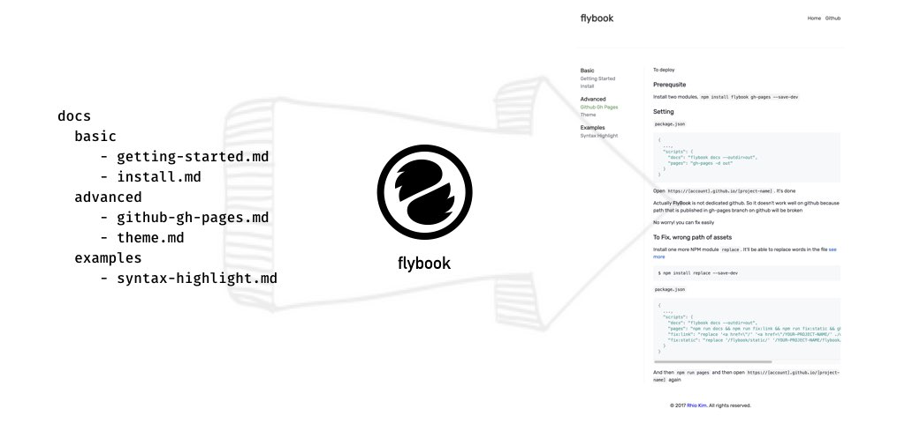

[](https://rhiokim.github.io/flybook)

Just write markdown, Flybook will create your book.

`FlyBook` is a simple utility to generate static website. This is inspired by [funbook](https://funbook.js.org/) and [next.js export functionality](https://zeit.co/blog/next)

Rewrited using by **React** and **React DOM Server**

## Goals
Already we know that we can have a number of document tools to publish markdown docs.
So flybook will keep in simplest way to generate static web site for writing the manual of project

## How flybook works


## How to use flybook

For example, Flybook documentation structure look like below
```
$ ls /path/to/project/docs
docs
|____advanced
| \____theme.md
|____basic
| \____getting-started.md
| \____install.md
|____examples
| \____syntax-highlight.md
|____readme.md
```

**globally**
```
$ npm i -g flybook
$ cd /path/to/project

$ flybook docs
> FlyBook was generated at /Users/rhio/Works/my/fly-book/out
```

**with NPM Project**
```
$ cd /path/to/project
$ npm install flybook --save-dev
$
$ vi package.json

  ,
  "scripts": {
    ...,
    "docs": "flybook docs --outdir=out"
  },
  ...
// after save

$ npm run docs
```

## Development

Turn on the auto build mode after `npm install`
```
$ git clone git@github.com:rhiokim/flybook
$ cd flybook
$ npm install
$ npm run build
```

After that you are able to see the notification with your code changes automatically

* npm run release   // build
* npm run docs      // generate a book with newest code

## License
MIT